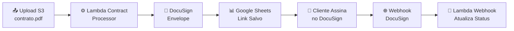

# 📝 Sistema de Assinatura Digital de Contratos

> **Sistema completo de assinatura digital** - Processamento automático de contratos via AWS Lambda, DocuSign e Google Sheets com arquitetura 100% serverless.

[](https://aws.amazon.com/)
[](https://terraform.io)
[]()
[]()

## 🎯 Visão Geral do Sistema

Este sistema automatiza completamente o processo de assinatura digital de contratos, desde o upload até a confirmação da assinatura. Utiliza arquitetura **serverless** com apenas **2 funções Lambda** para manter simplicidade e eficiência.

### ✨ Funcionalidades Principais

- 🔄 **Processamento Automático**: Upload → Link DocuSign → Assinatura → Confirmação
- 📊 **Integração Google Sheets**: Controle completo do status dos contratos
- 🌐 **Webhooks DocuSign**: Atualização automática quando contratos são assinados
- 📧 **Notificações**: Sistema preparado para envio de emails (opcional)
- 🔍 **Monitoramento**: Logs detalhados no CloudWatch

### 🏗️ Arquitetura Simplificada



**Apenas 2 Lambdas:**
- **Lambda Contract Processor**: Acionado por upload no S3, gera links DocuSign
- **Lambda Webhook**: Recebe confirmações de assinatura via API Gateway

## 📁 Estrutura do Projeto

```
docusign_ura/
├── 📂 lambda-contract-processor/     # Lambda para processamento de contratos
│   ├── lambda_handler.py            # Handler principal (acionado por S3)
│   └── requirements.txt             # Dependências Python
├── 📂 lambda-webhook/                # Lambda para webhooks DocuSign
│   ├── lambda_handler.py            # Handler para webhooks via API Gateway
│   └── requirements.txt             # Dependências Python
├── 📂 app/                          # Código core DocuSign (desenvolvimento local)
│   ├── aws_s3_helper.py             # Helper para operações S3
│   ├── jwt_config.py                # Configuração JWT DocuSign
│   └── eSignature/                  # SDK DocuSign modificado
├── 📂 shared/                       # Código compartilhado entre lambdas
│   ├── aws_s3_helper.py             # Helper S3 compartilhado
│   ├── google_sheets_helper.py      # Integração Google Sheets
│   ├── jwt_config.py                # Config JWT compartilhado
│   └── eSignature/                  # SDK DocuSign compartilhado
├── 📂 infrastructure/               # Infraestrutura como código
│   ├── main.tf                      # Configuração AWS completa (Terraform)
│   ├── build.sh                     # Script para build dos pacotes Lambda
│   ├── deploy.sh                    # Script para deploy completo
│   └── terraform.tfvars.example     # Exemplo de variáveis Terraform
├── 📄 test_lambda_webhook.py        # Suite completa de testes do webhook
├── 📄 test_webhook_example.json     # Dados de exemplo para testes
├── 📄 contract_signing_api.py       # Script principal para desenvolvimento local
├── 📄 contrato_monitor.py           # Monitor local para desenvolvimento
├── 📄 .gitignore                    # Controle de versão (Git)
└── 📄 README.md                     # Esta documentação completa
```

## 🔧 Pré-requisitos

### AWS
- ✅ **AWS CLI** configurado: `aws configure`
- ✅ **Terraform** v1.0+: `terraform version`
- ✅ **Conta AWS** com permissões IAM adequadas

### Google Sheets
- ✅ **Projeto Google Cloud** com Google Sheets API habilitado
- ✅ **Service Account** com chave JSON
- ✅ **Planilha "URA_Backend"** criada com worksheet "URA_Tickets"

### DocuSign
- ✅ **Conta DocuSign** com API habilitada
- ✅ **Integration Key** e **User ID** configurados
- ✅ **Chave privada RSA** (private.key) gerada

## 🚀 Deploy em 5 Minutos

### 1. Clonagem e Configuração
```bash
# Clonar projeto
git clone <seu-repo>
cd docusign_ura

# Configurar variáveis Terraform
cd infrastructure
cp terraform.tfvars.example terraform.tfvars
# Editar terraform.tfvars com suas configurações
```

### 2. Deploy Completo
```bash
# Executar deploy (constrói Lambdas + Terraform)
./deploy.sh
```

**Resultado esperado:**
```
✅ S3 Bucket: template-trigger-docusign
✅ Lambda Contract Processor: arn:aws:lambda:...
✅ Lambda Webhook: arn:aws:lambda:...
✅ API Gateway URL: https://abc123.execute-api.us-east-1.amazonaws.com/dev
```

## 📤 Como Usar o Sistema

### 1. Upload de Contratos
```bash
# Upload contrato para S3 (o nome do arquivo deve conter nome_email)
aws s3 cp "contrato_joao-silva-joao@email.com.pdf" s3://template-trigger-docusign/contratos-gerados/
```

### 2. Fluxo Automático
1. **Upload** → Lambda Contract Processor é acionado automaticamente
2. **Processamento** → Sistema extrai dados e cria envelope DocuSign
3. **Link Gerado** → URL de assinatura é salva no Google Sheets
4. **Cliente Assina** → Link é enviado ao cliente via WhatsApp/email
5. **Confirmação** → Cliente assina no DocuSign
6. **Webhook** → DocuSign notifica sistema da assinatura
7. **Atualização** → Status muda para "Assinado" no Google Sheets

### 3. Monitoramento em Tempo Real
```bash
# Ver logs das Lambdas
aws logs tail /aws/lambda/contrato-assinatura-contract-processor-dev --follow
aws logs tail /aws/lambda/contrato-assinatura-webhook-dev --follow

# Verificar status no Google Sheets
# Acesse: https://docs.google.com/spreadsheets/d/YOUR_SPREADSHEET_ID
```

## 🧪 Testes e Validação

### Teste do Lambda Webhook

#### **🧪 `test_lambda_webhook.py`** - Teste Completo do Webhook
```bash
# Teste local direto (handler puro)
python test_lambda_webhook.py --local

# Teste no formato Lambda (evento API Gateway)
python test_lambda_webhook.py --lambda

# Servidor HTTP local para testes reais
python test_lambda_webhook.py --http

# Criar arquivo de teste JSON
python test_lambda_webhook.py --create-test-file

# Executar todos os testes
python test_lambda_webhook.py --all
```

#### **📄 Exemplo de Webhook**
O arquivo `test_webhook_example.json` contém um exemplo completo de webhook de assinatura:

```json
{
  "event": "envelope-completed",
  "data": {
    "envelopeId": "12345678-1234-1234-1234-123456789012",
    "envelopeSummary": {
      "status": "completed",
      "completedDateTime": "2025-10-29T14:30:00Z",
      "recipients": {
        "signers": [
          {
            "email": "joao.silva@email.com",
            "name": "João Silva",
            "status": "completed",
            "signedDateTime": "2025-10-29T14:25:00Z"
          }
        ]
      }
    }
  }
}
```

#### **🌐 Teste com Servidor HTTP**
```bash
# 1. Iniciar servidor de teste
python test_lambda_webhook.py --http

# 2. Em outro terminal, testar webhook
curl -X POST http://localhost:8080/webhook \
  -H "Content-Type: application/json" \
  -d @test_webhook_example.json

# 3. Testar health check
curl http://localhost:8080/
```

## 💻 Desenvolvimento Local

### Configuração Inicial
```bash
# Instalar dependências
pip install -r requirements.txt

# Configurar credenciais (copiar e editar)
cp config.env.example config.env
# Editar config.env com suas credenciais AWS/DocuSign/Google
```

### Scripts de Desenvolvimento

#### **🎯 `contract_signing_api.py`** - Teste Local Completo
```bash
# Execução completa (DocuSign + Google Sheets)
python contract_signing_api.py --email "cliente@email.com" --name "Nome Cliente"

# Apenas DocuSign (sem Google Sheets)
python contract_signing_api.py --email "cliente@email.com" --name "Nome Cliente" --no-sheets

# Modo debug detalhado
python contract_signing_api.py --debug --email "cliente@email.com" --name "Nome Cliente"
```

#### **🧪 `test_lambda_webhook.py`** - Testes do Webhook
```bash
# Teste local direto
python test_lambda_webhook.py --local

# Teste no formato Lambda
python test_lambda_webhook.py --lambda-format

# Servidor HTTP para testes
python test_lambda_webhook.py --http

# Todos os testes
python test_lambda_webhook.py --all
```

#### **👀 `contrato_monitor.py`** - Monitor Local (Desenvolvimento)
```bash
# Monitora S3 continuamente por novos contratos
python contrato_monitor.py
```

#### **🚀 `contrato_monitor_launcher.py`** - Launcher do Monitor
```bash
# Executa diferentes modos do monitor
python contrato_monitor_launcher.py daemon    # Modo background
python contrato_monitor_launcher.py check     # Verificação única
python contrato_monitor_launcher.py stats     # Estatísticas
```

#### **🧪 `test_docusign_webhook.py`** - Teste de Webhooks
```bash
# Teste local (sem HTTP)
python test_docusign_webhook.py --local

# Teste com API rodando
python test_docusign_webhook.py
```

### API Local

#### **🏠 Executar API Flask:**
```bash
cd api/
python run_api.py
# API disponível em: http://localhost:5000
```

#### **📖 Documentação Swagger:**
- **URL**: `http://localhost:5000/docs`
- **OpenAPI**: `http://localhost:5000/swagger.json`

#### **🔗 Endpoints Disponíveis:**
- `GET /health` - Status da API
- `GET /contracts` - Lista contratos processados
- `GET /contract/{filename}` - Contrato específico
- `POST /webhook/docusign` - Webhook DocuSign

## ⚙️ Pré-requisitos

### AWS
- ✅ **AWS CLI** configurado: `aws configure`
- ✅ **Terraform** v1.0+: `terraform version`
- ✅ **Conta AWS** com permissões IAM adequadas

### Google Sheets
- ✅ **Service Account** do Google Cloud configurado
- ✅ **Planilha** "URA_Backend" criada no Google Sheets
- ✅ **Worksheet** "URA_Tickets" criada na planilha

### DocuSign
- ✅ **Conta DocuSign** com API habilitada
- ✅ **Integration Key** e **User ID**
- ✅ **Chave privada RSA** gerada

## 🚀 Deploy em 5 Minutos

### 1. Clonar e Configurar
```bash
# Clonar projeto
git clone <seu-repo>
cd contrato-assinatura-aws

# Configurar variáveis
cd infrastructure
cp terraform.tfvars.example terraform.tfvars

# Editar terraform.tfvars com suas configurações:
# - aws_region
# - google_sheets_config (opcional - para testes locais)
```

### 2. Deploy Completo
```bash
# Executar deploy (constrói Lambdas + Terraform)
./deploy.sh
```

**O que o script faz:**
- 🔨 **Constrói** pacotes Lambda com dependências
- 📦 **Inicializa** Terraform
- 🏗️ **Cria** toda infraestrutura AWS
- 📋 **Exibe** URLs e ARNs criados

### 3. Resultado do Deploy
Após execução, você terá:
```
✅ S3 Bucket Contratos: template-trigger-docusign
✅ API Gateway URL: https://abc123.execute-api.us-east-1.amazonaws.com/dev
✅ Lambda Monitor ARN: arn:aws:lambda:us-east-1:123456789:function:contrato-assinatura-monitor-dev
✅ E muito mais...
```

## 🔧 Configuração Google Sheets

### 1. Service Account Google Cloud
```bash
# 1. Criar projeto no Google Cloud Console
# 2. Habilitar Google Sheets API
# 3. Criar Service Account
# 4. Gerar chave JSON
# 5. Upload da chave para S3:
aws s3 cp "service-account-key.json" s3://jsoninnovatis/chave2.json
```

### 2. Planilha Google Sheets
- **Nome da planilha**: `URA_Backend`
- **Worksheet**: `URA_Tickets`
- **Colunas obrigatórias**:
  - `nome`: Nome do signatário
  - `email`: Email do signatário
  - `link_contrato`: Link DocuSign gerado
  - `data_criacao`: Data/hora de criação
  - `status`: Status (Pendente/Enviado/Assinado)

### 3. Permissões
Certifique-se que o Service Account tem acesso à planilha:
- Compartilhar planilha com email do Service Account
- Dar permissões de "Editor"

## 📤 Como Usar o Sistema

### 1. Upload de Contratos
```bash
# Upload contrato para S3 (formato: nome_email.pdf)
aws s3 cp "joao-silva-joao.silva@email.com.pdf" s3://template-trigger-docusign/contratos-gerados/
```

### 2. Fluxo Automático
```
1. 📤 Upload → S3 trigger dispara Lambda Contract Processor
2. ⚙️ Lambda processa contrato automaticamente
3. 🔗 Gera link DocuSign
4. 📊 Salva link no Google Sheets
5. 📧 Cliente recebe link para assinatura
6. ✅ Cliente assina → DocuSign envia webhook
7. 🌐 Lambda Webhook atualiza status para "Assinado"
```

### 3. Cliente Recebe Link
Quando o cliente clicar "Comunidade INNOVATIS" no WhatsApp:
- Sistema busca contrato pelo email
- Retorna link de assinatura DocuSign
- Cliente assina diretamente no navegador

## 📊 Monitoramento e Logs

### CloudWatch Logs
```bash
# Logs das funções Lambda
aws logs tail /aws/lambda/contrato-assinatura-api-dev --follow
aws logs tail /aws/lambda/contrato-assinatura-monitor-dev --follow
aws logs tail /aws/lambda/contrato-assinatura-processor-dev --follow
```

### Métricas Importantes
- **Lambda Invocations**: Processamento ativo
- **SQS Messages**: Fila de processamento
- **API Gateway Requests**: Atividade da API
- **S3 Objects**: Contratos processados

## 🧪 Testes e Validação

### Teste da API
```bash
# Health check
curl https://your-api-gateway-url/health

# Listar contratos
curl https://your-api-gateway-url/contracts

# Buscar contrato por email
curl "https://your-api-gateway-url/contract/by-email/joao.silva@email.com"
```

### Teste do Processador
```bash
# Testar processamento (simula upload para S3)
python processor/contrato_processor.py '{
  "filename": "contrato_joao-silva-joao.silva@email.com.pdf",
  "extracted_name": "João Silva",
  "extracted_email": "joao.silva@email.com",
  "contract_key": "test_key_123"
}'
```

## 🔧 Parâmetros de Configuração

| Variável | Descrição | Exemplo |
|----------|-----------|---------|
| `aws_region` | Região AWS | `us-east-1` |
| `project_name` | Nome do projeto | `contrato-assinatura` |
| `environment` | Ambiente | `dev`, `staging`, `prod` |
| `s3_bucket_name` | Bucket S3 existente | `template-trigger-docusign` |

## 🏁 Próximos Passos Após Deploy

1. ✅ **Configurar Google Sheets** (Service Account + Planilha)
2. ✅ **Testar upload** de contrato para S3
3. ✅ **Verificar processamento** automático
4. ✅ **Validar links** no Google Sheets
5. ✅ **Monitorar logs** no CloudWatch

## 🛠️ Troubleshooting

### Problema: Google Sheets não funciona
```bash
# Verificar credenciais no S3
aws s3 ls s3://jsoninnovatis/chave2.json

# Testar conexão Google Sheets localmente
python test_google_sheets.py

# Verificar se planilha existe e tem permissões
# https://docs.google.com/spreadsheets/d/YOUR_SPREADSHEET_ID
```

### Problema: Contrato não processado
```bash
# Verificar fila SQS
aws sqs get-queue-attributes --queue-url YOUR_QUEUE_URL --attribute-names ApproximateNumberOfMessages

# Verificar logs Lambda Monitor/Processor
aws logs tail /aws/lambda/contrato-assinatura-monitor-dev --follow
```

### Problema: Link DocuSign não gerado
- Verificar configuração DocuSign em `app/jwt_config.py`
- Verificar chave privada em `app/private.key`
- Verificar logs Lambda Processor

## 🔧 Troubleshooting

### Problema: Lambda Contract Processor não é acionado

**Sintomas:** Upload para S3 não dispara processamento automático

**Soluções:**
```bash
# Verificar se trigger S3 está configurado
aws s3api get-bucket-notification-configuration --bucket template-trigger-docusign

# Verificar logs da Lambda
aws logs tail /aws/lambda/contrato-assinatura-contract-processor-dev --follow

# Verificar permissões IAM da Lambda
aws lambda get-policy --function-name contrato-assinatura-contract-processor-dev
```

### Problema: Webhook não atualiza Google Sheets

**Sintomas:** Contrato aparece como "Assinado" mas status não muda no Google Sheets

**Soluções:**
```bash
# Testar webhook localmente
python test_lambda_webhook.py --local

# Verificar credenciais Google Sheets no S3
aws s3 ls s3://jsoninnovatis/chave2.json

# Verificar logs da Lambda Webhook
aws logs tail /aws/lambda/contrato-assinatura-webhook-dev --follow

# Verificar se email existe na planilha
# Acesse: https://docs.google.com/spreadsheets/d/YOUR_SPREADSHEET_ID
```

### Problema: DocuSign retorna erro de autenticação

**Sintomas:** Envelope não é criado, erro de JWT/token

**Soluções:**
- Verificar se `private.key` existe e está correta
- Verificar configurações JWT em `app/jwt_config.py`
- Confirmar Integration Key e User ID no DocuSign
- Verificar se conta DocuSign tem API habilitada

### Problema: Timeout na Lambda

**Sintomas:** Lambda falha com timeout (30s para webhook, 300s para processor)

**Soluções:**
- Verificar conectividade de rede (Google Sheets pode ser lento)
- Otimizar queries do Google Sheets
- Verificar se bucket S3 está na mesma região
- Considerar aumentar timeout no Terraform se necessário

### Problema: Email não encontrado no Google Sheets

**Sintomas:** "Contract not found for email: xxx"

**Soluções:**
- Verificar se email está correto no nome do arquivo PDF
- Confirmar se linha existe na planilha Google Sheets
- Verificar se a planilha tem as permissões corretas para o Service Account
- Verificar mapeamento de colunas no `google_sheets_helper.py`

## 📊 Monitoramento e Logs

### CloudWatch Logs
```bash
# Contract Processor
aws logs tail /aws/lambda/contrato-assinatura-contract-processor-dev --follow

# Webhook Handler
aws logs tail /aws/lambda/contrato-assinatura-webhook-dev --follow

# Filtrar por período
aws logs filter-log-events \
  --log-group-name /aws/lambda/contrato-assinatura-contract-processor-dev \
  --start-time $(date -d '1 hour ago' +%s000) \
  --filter-pattern ERROR
```

### Métricas Importantes
- **Invocações Lambda**: Processamento ativo
- **Duração**: Performance das funções
- **Erros**: Taxa de falha
- **S3 Objects**: Contratos processados
- **API Gateway Requests**: Atividade de webhooks

## 💰 Custos Estimados (AWS)

| Serviço | Custo Mensal | Notas |
|---------|--------------|-------|
| **Lambda** | $0.20-2.00 | Por 1M execuções |
| **API Gateway** | $3.50 | Por 1M requests |
| **S3** | $0.02-0.10 | Por GB armazenado |
| **CloudWatch** | $0.30 | Por GB logs |
| **Total Estimado** | **$3.52-5.90** | Para uso moderado (100 contratos/mês) |

## 📞 Suporte

Para suporte técnico:
- 📧 **Email**: suporte@innovatismc.com
- 📋 **Documentação**: Este README completo
- 🔍 **Logs**: CloudWatch para debugging avançado
- 🧪 **Testes**: `test_lambda_webhook.py` para validação

---

**🎉 Sistema pronto para automatizar seus contratos digitais!**

> **Próximos passos:** Faça o deploy, teste com um contrato real e veja a magia acontecer! ✨
